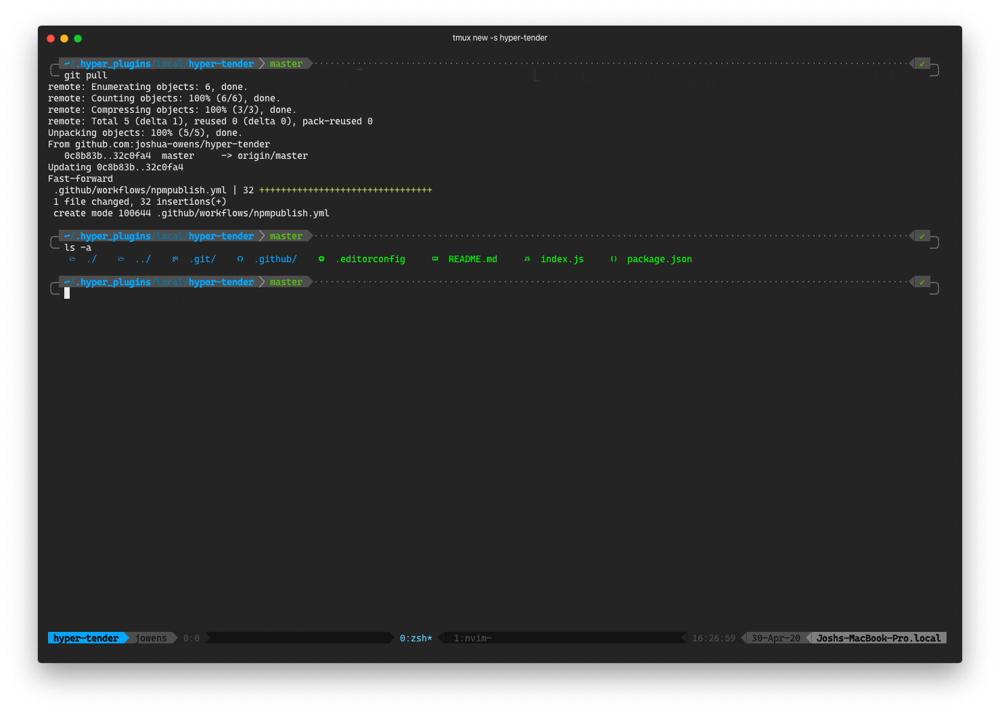

# hyper-tender

> A dark [Hyper](http://hyper.is/) theme inspired by [tender.vim](https://github.com/jacoborus/tender.vim)

## Installation

### Install using the Hyper CLI

    $ hyper install hyper-tender

### Install using the Hyper config file

Add `hyper-tender` to the plugins list in your `~/.hyper.js` config file.

    plugins: [
      'hyper-tender'
    ]

### Reload Hyper to start using the theme

- Mac: <kbd>⌘ Command</kbd> <kbd>⇧ Shift</kbd> <kbd>R</kbd>
- Windows & Linux: <kbd>⌃ Control</kbd> <kbd>⇧ Shift</kbd> <kbd>R</kbd>

## Screenshot

The screenshot above includes some additional tools:

- [CascadiaCode Nerd Font](https://github.com/ryanoasis/nerd-fonts/tree/master/patched-fonts/CascadiaCode)
- [Oh My Zsh](https://ohmyz.sh/) with the [Powerlevel10k theme](https://github.com/romkatv/powerlevel10k)
- [Tmux](https://github.com/tmux/tmux) with the [Cyan Themepack](https://github.com/jimeh/tmux-themepack/blob/master/powerline/default/cyan.tmuxtheme)
- [colorls](https://github.com/athityakumar/colorls)
